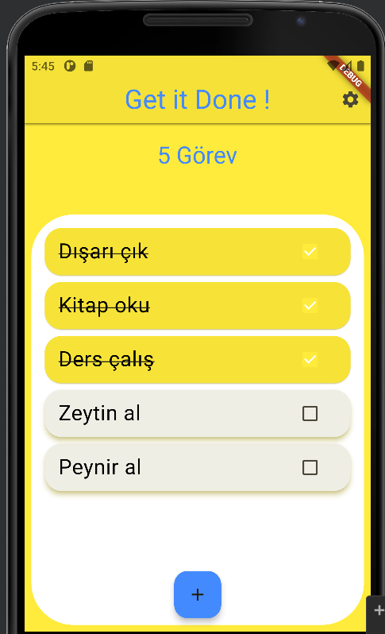
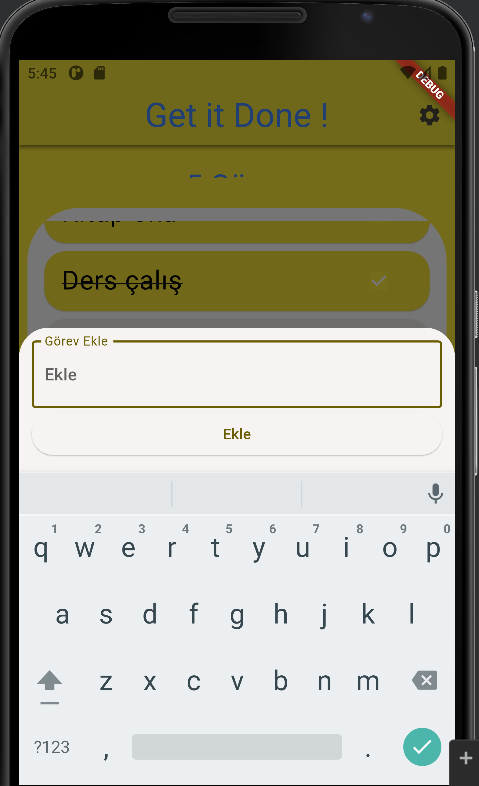
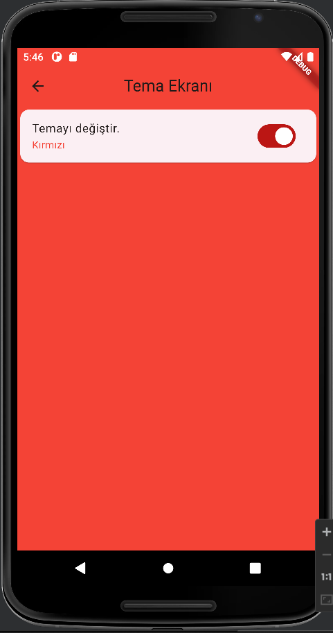
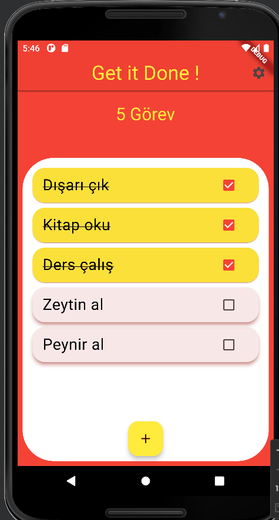

# Görev Takip Uygulaması
Bu projede, kullanıcıların yapmaları gereken işleri takip edebilecekleri, yeni görevler ekleyebilecekleri, görevleri tamamlandı olarak işaretleyebilecekleri ve gerektiğinde görevleri tamamen silebilecekleri bir görev takip uygulaması geliştirilmiştir. Bu uygulamada kullanılan paketler ve yapılar şunlardır:

<b>Provider Paketi ve MultiProvider Yapısı:<b> Provider paketi, Flutter uygulamalarında durum yönetimi için kullanılan bir pakettir. MultiProvider yapısı ise birden fazla Provider'ı uygulamaya entegre etmek için kullanılır. Bu yapılar sayesinde uygulama içindeki durumları yönetmek ve gerektiğinde bu durumları tüm uygulama geneline yaymak mümkün olur.

<b>SharedPreferences Yapısı:<b> SharedPreferences, Flutter uygulamalarında küçük veri parçalarını (örneğin kullanıcı tercihleri, oturum açma bilgileri vb.) depolamak için kullanılan bir yapıdır. Bu yapı sayesinde uygulama, kullanıcıların görevleri veya diğer tercihleri gibi verilerini saklayabilir ve gerektiğinde bu verilere erişebilir.

<b>Thema Uygulamaları:<b> Tema uygulamaları, Flutter'da uygulama genelinde kullanılacak renkler, yazı tipleri ve diğer görsel öğeler gibi tasarım öğelerini yönetmek için kullanılır. Bu sayede uygulamanın görünümü ve hissiyatı kolayca değiştirilebilir ve özelleştirilebilir.

Bu yapılar ve paketler kullanılarak geliştirilen görev takip uygulaması, kullanıcıların işlerini organize etmelerine ve verimliliklerini artırmalarına yardımcı olacak bir araç sunmayı amaçlar.

## Ekran Görüntüleri 

